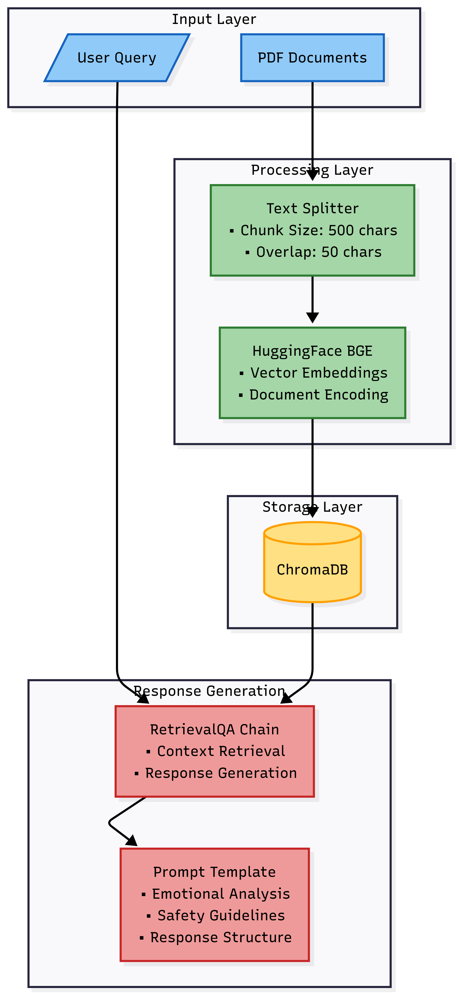

Great! Based on your **current folder structure** and project contents (as shown in the image), here's your **updated and fully structured `README.md`** tailored for:

* Your **Gradio-based SoulCare chatbot**
* **Modular Python setup** inside `src/` and `chatbot/`
* **Data** in `data/`
* **Vector DB** in `chroma_db/`
* Jupyter notebook for **EDA**
* Embedded **workflow diagram**
* Gemini/Groq API usage instructions

---

### ✅ Final `README.md` (copy this into your repo root)

```markdown
# 🧠 SoulCare Chatbot – GenAI Mental Health Assistant

Welcome to **SoulCare**, a GenAI-powered chatbot designed to offer **empathetic mental health support** by understanding emotional context and retrieving relevant responses from custom-trained PDFs. This project uses **LLaMA-3.3 70B** via **Groq**, HuggingFace embeddings, and Gradio UI.

---

## ✨ Features

- 🤗 Emotion-sensitive and non-judgmental conversation
- 📄 Custom PDF-based knowledge base
- ⚙️ Modular & production-ready Python code
- ⚡ Powered by Groq (LLaMA 3.3 70B) and HuggingFace Embeddings
- 🧠 Intelligent RetrievalQA from `ChromaDB`
- 🌐 Easy-to-use UI with inspirational design
- 🔐 Handles crisis queries with safe prompts

---

## 📁 Folder Structure

```
final_project/
├── chatbot/                  # Core logic (LLM setup, prompts, chains)
│   ├── cores.py
│   ├── prompts.py
│   └── __init__.py
│
├── chroma_db/               # Auto-generated vector database (Chroma)
│   ├── chroma.sqlite3
│   └── ...                  # Other DB-related files
│
├── data/                    # PDF files for embedding/training
│   ├── BK03712-Art-of-Empathy-web-sample.pdf
│   ├── Daniel Kahneman-Thinking, Fast and Slow.pdf
│   └── mental_health_Document.pdf
│
├── notebook/                # Exploratory notebooks (EDA)
│   └── EDA.ipynb
│
├── src/                     # Application entry point and configuration
│   ├── app.py
│   ├── config.py
│   └── __init__.py
│
├── workflow.png             # Visual flowchart of system architecture
├── requirements.txt         # Python dependencies
├── .gitignore               # Files/folders excluded from Git tracking
└── README.md                # Project documentation (you're reading it!)


````

---

## 🧠 Project Scope & Goal

In today’s fast-paced world, people often seek someone to talk to or a moment of calm. **SoulCare** bridges that gap using generative AI, providing:

- Compassionate listening
- Practical strategies for stress, anxiety, sadness
- Escalation suggestion during emergencies (never diagnosis)

Built for **students, professionals, or anyone feeling overwhelmed**, SoulCare respects **data privacy**, offers **offline vector search**, and encourages **mental wellness**.

---

## 🖥️ How It Works

1. **User enters query**
2. **Text is matched** with relevant content in vector DB
3. **RetrievalQA** fetches context & uses Groq LLM
4. **Safety-aware prompt** guides the chatbot
5. **Response shown** via a Gradio web UI

---

## 🧩 Workflow Diagram

> Flow of your SoulCare system:



---

## ⚙️ Setup Instructions

### 1. Clone the Repository

```bash
git clone https://github.com/Mahesh8214/SoulCare-chatbot-GenAI.git
cd SoulCare-chatbot-GenAI
````

### 2. Create Virtual Environment (Optional)

```bash
python -m venv medi_bot
.\medi_bot\Scripts\activate
```

### 3. Install Required Packages

```bash
pip install -r requirements.txt
```

### 4. Configure API Keys

Create a file `src/config.py` and add:

```python
GROQ_API_KEY = "your_groq_api_key"
LLM_MODEL = "llama-3.3-70b-versatile"
EMBEDDING_MODEL = "sentence-transformers/all-MiniLM-L6-v2"
DATA_DIR = "./data"
DB_DIR = "./chroma_db"
```

> ⚠️ **Never commit your API key to GitHub!** Add `config.py` to `.gitignore`.

---

## 🚀 Run the App

```bash
cd src
python app.py
```

Open [http://127.0.0.1:7860](http://127.0.0.1:7860) in your browser.

---

## 🔎 EDA / Exploration

Explore PDF data and embeddings:

```bash
# Jupyter Notebook
cd notebook
jupyter notebook EDA.ipynb
```

---

## 💬 Example Prompts

* “I’m feeling anxious, what should I do?”
* “Suggest ways to cope with sadness.”
* “Life feels overwhelming. Help.”

---

## 🌈 UI Experience

* Elegant teal-themed Gradio interface
* Encouraging quotes
* Safety alerts in-case of distress signals
* Example prompts and clean layout

---

## 🧘 Inspiring Quote

> *“You are not alone. This moment will pass, and you will grow stronger through it.”*

---

## 🧹 .gitignore

```gitignore
# Ignore vector DB and config
chroma_db/
__pycache__/
*.pyc
src/config.py
.ipynb_checkpoints/
.env
```

---

## 📌 To-Do / Future Scope

* Add user journaling
* Emotion tracking dashboard
* Therapist integration
* Multilingual support

---

## 📜 License

This project is licensed under the MIT License.
Made with 💚 by **Mahesh Singh**

---

## 🙌 Acknowledgments

* [LangChain](https://www.langchain.com/)
* [Groq](https://console.groq.com/)
* [HuggingFace](https://huggingface.co/)
* [Chroma](https://www.trychroma.com/)
* Mental health communities

---

> **🧠 SoulCare – Speak freely. Heal deeply. Grow wisely.**

```

---

### ✅ Final Notes

Let me know if you’d like me to:
- Export this to a downloadable `README.md` file
- Add badges (like MIT license, Python version, etc.)
- Update with live deployment instructions

You're now ready to confidently publish and maintain your project professionally on GitHub! 💪
```
